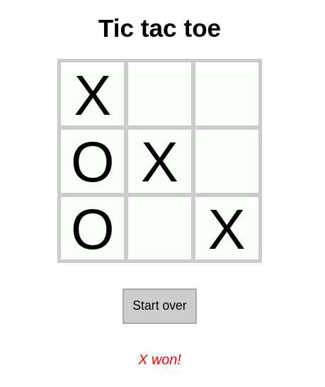

# TicTacToe: A practice project
`practice-react-tictactoe` is a practice project to test out React skills.

**Test it out at [https://graphicalx.github.io/practice-react-tictactoe/](https://graphicalx.github.io/practice-react-tictactoe/)**

## 2 Jan 2023
I moved state to Redux, which obviously wasn't required for such a small app :)